---
format:
  revealjs:
    highlight-style: a11y
    auto-stretch: true
    hash-type: number
    slide-number: false
    controls: auto
    progress: false
    from: markdown+emoji
    theme:
    - custom.scss
    center: false
    include-in-header: noindex.html
    menu:
      width: full
---

## {background-image="cogs.jpg"}

::: r-fit-text
::: {style="font-size:2.4em; padding: 0.5em 1em; background-color: rgba(255, 255, 255, .8);"}
Usar y mejorar tu historial de Git
:::
:::
 
::: {.absolute left="5%" bottom="5%"  style="font-size:1.2em; padding: 0.5em 1em; background-color: rgba(255, 255, 255, .8);"}
Maëlle Salmon

<https://historial-git.netlify.app>
:::

::: {.notes}
Engranajes <https://www.pexels.com/photo/colorful-toothed-wheels-171198/>
:::

## ¿Qué es Git? {.center}

Git es un Sistema de Control de Versión (VCS).

## ¿Qué es Git? {.center}

> Git se [parece] más a un sistema de archivos miniatura con algunas herramientas tremendamente poderosas desarrolladas sobre él, que a un VCS [(sistema de control de versión)].

[Scott Chacon, Pro Git (traducción en español)](https://git-scm.com/book/es/v2/Inicio---Sobre-el-Control-de-Versiones-Fundamentos-de-Git)

## ¿Por qué Git? {.center}

> Después de confirmar [un commit] en Git es muy difícil perderla, especialmente si envías [esos cambios] a otro repositorio con regularidad.

[Scott Chacon, Pro Git (traducción en español)](https://git-scm.com/book/es/v2/Inicio---Sobre-el-Control-de-Versiones-Fundamentos-de-Git)

## Además {.center}

. . .

:scroll: Historial que usar

. . .

:deciduous_tree: Ramas


## Historial de Git {.center}

Pequeños _commits_ (modificaciones) con mensajes informativos.

## Una línea de codigo misteriosa

<div style="display:grid ; margin-top : 0rem ;"><figure>
    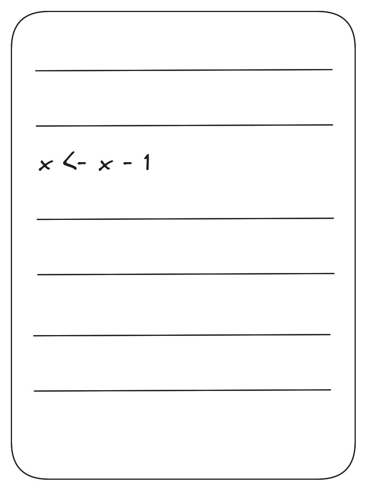 
</figure></div>

## git blame

<div style="display:grid ; margin-top : 0rem ;"><figure>
    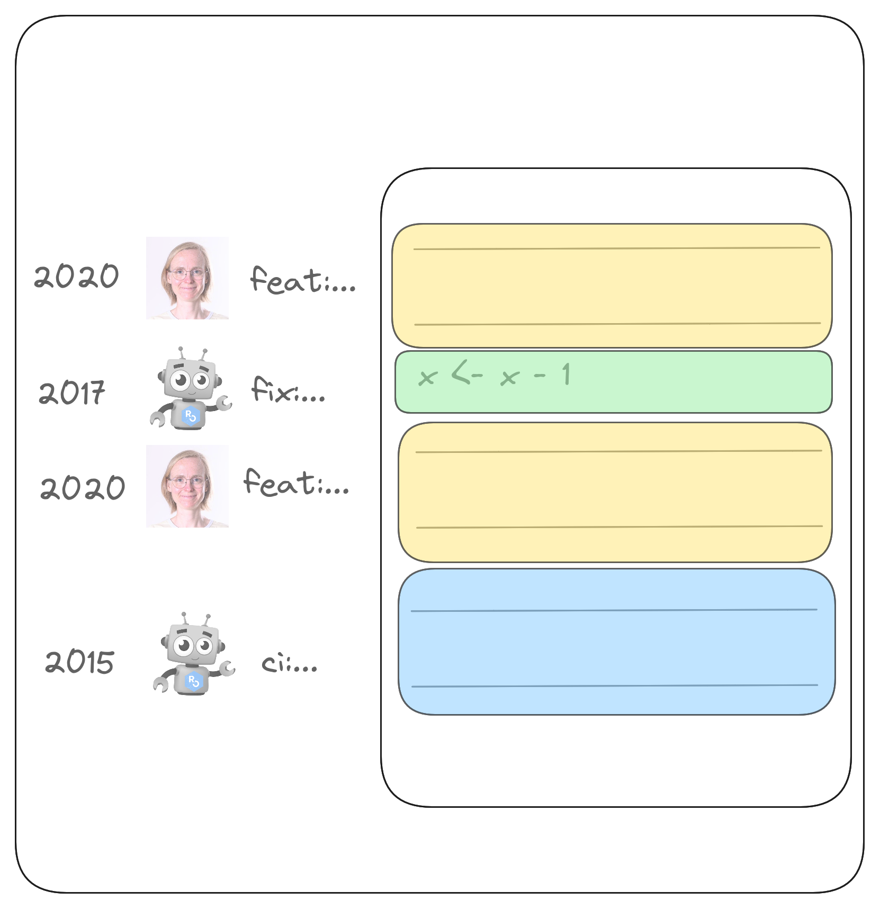 
</figure></div>

## Git blame : haz un clic en el commit... {.center}

## Git blame : haz un clic en el commit...

> "Añadir un montón de archivos antes del almuerzo :spaghetti:"

Muestra 145 ficheros modificados con 2.624 addiciones y 2.209 supresiones.

## Git blame : haz un clic en el commit...

> "fix: adaptar el código al índice 0 de la herramienta"

Visualización de 2 ficheros modificados con 3 addiciones y 2 supresiones.

## Git blame : ejemplo

[En pkgdown](https://github.com/r-lib/pkgdown/blame/main/R/build-article.R)

## Una mala idea hace 7 commits

¡Oh no, esa idea de hace 7 commits está mal! Deberíamos...

::: {.incremental}

- Borrar la modificación manualmente ;

- Revertir ("Revert") el commit que añadió la modificación?

:::

## Git revert

Esto sólo funciona bien si el commit es pequeño.

## Git revert : práctica ! {.center}

Recordatorio de nuestra primera sesión de Git. :wink:

5 minutos (en la sala principal)

```r
withr::local_language("es")
dir  <- withr::local_tempdir()
saperlipopette::exo_undo_commit(dir)
```

## Tú haciendo algo hace tres días

<div style="display:grid ; margin-top : 0rem ;"><figure>
    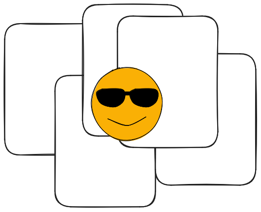. 
</figure></div>

## Tú haciendo lo mismo hoy

<div style="display:grid ; margin-top : 0rem ;"><figure>
    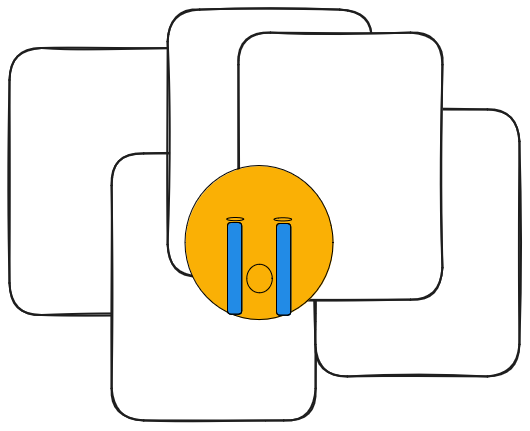. 
</figure></div>

## Git bisect : historial de los commits

<div style="display:grid ; margin-top : 0rem ;"><figure>
    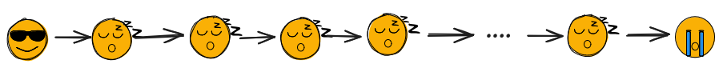. 
</figure></div>

## Git bisect : explora los commits de la mejor manera posible

<div style="display:grid ; margin-top : 0rem ;"><figure>
    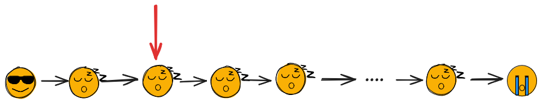 
</figure></div>

## Git bisect : explora los commits de la mejor manera posible

<div style="display:grid ; margin-top : 0rem ;"><figure>
    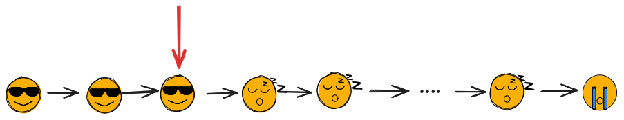 
</figure></div>

## Git bisect : explora los commits de la mejor manera posible

<div style="display:grid ; margin-top : 0rem ;"><figure>
    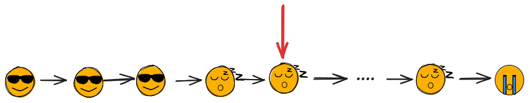 
</figure></div>

## Git bisect : explora los commits de la mejor manera posible

<div style="display:grid ; margin-top : 0rem ;"><figure>
    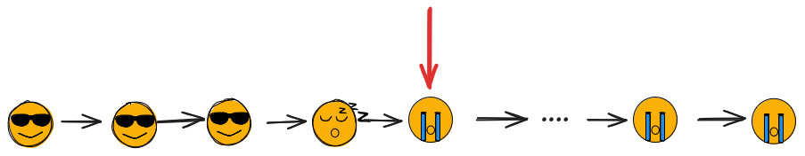 
</figure></div>

## Git bisect : explora los commits de la mejor manera posible

<div style="display:grid ; margin-top : 0rem ;"><figure>
    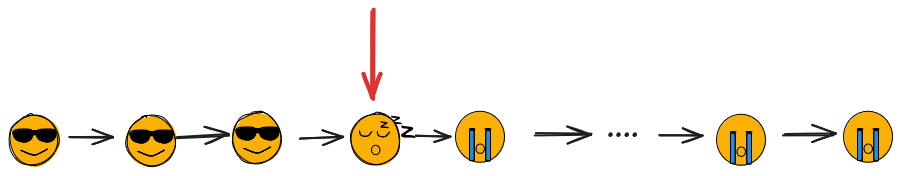 
</figure></div>

## Git bisect : explora los commits de la mejor manera posible

<div style="display:grid ; margin-top : 0rem ;"><figure>
    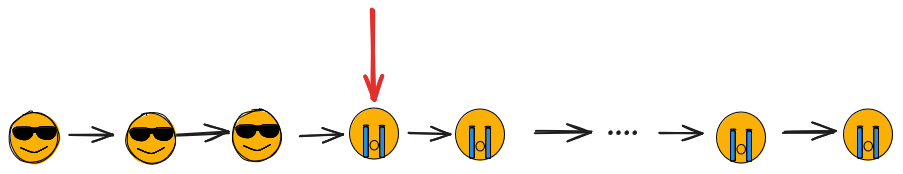 
</figure></div>

## Resultado de Git bisect : un commit !

## Resultado de Git bisect : un commit !

> "Añadir un montón de archivos antes del almuerzo :spaghetti:"

Muestra 145 ficheros modificados con 2.624 addiciones y 2.209 supresiones.

## Résultat de Git bisect : un commit !

> "refactor: empieza a usar YAML"

Visualización de 2 ficheros modificados con 3 addiciones y 2 supresiones.

## Git bisect : práctica ! {.center}

15 minutos

```r
withr::local_language("es")
dir  <- withr::local_tempdir()
saperlipopette::exo_bisect(dir)
```

## Historial de Git {.center}

> "“there’s no need for everyone to see the mistakes you made along the way”"

> traducción: "no hay necesidad de que todo el mundo vea los errores que cometiste en el camino".

Mike McQuaid, [Git in practice](https://www.manning.com/books/git-in-practice)

## Descanso 😮‍💨 {.center}

5 minutos

## Cómo obtener un bueno historial de Git

Otra dimensión de tu trabajo.

. . .

Entradas en mi blog (inglés)

- [The two phases of commits in a Git branch](https://masalmon.eu/2023/12/07/two-phases-git-branches/)

- [Hack your way to a good Git history](https://masalmon.eu/2024/06/11/rewrite-git-history/)

## {background-image="robin.jpg"}

::: {.absolute left="5%" top="65%"  style="font-size:1.4em; padding: 0.5em 1em; background-color: rgba(255, 255, 255, .8);"}
Trabajar en ramas
:::

::: {.notes}
Pajaro en una rama
<https://www.pexels.com/photo/european-robin-perched-on-tree-branch-in-winter-30807862/>
:::

## "La repetida enmienda"™️ : </br>`git commit --amend` {.center}

¿Qué es `git commit --amend`?

```r
withr::local_language("es")
dir  <- withr::local_tempdir()
saperlipopette::exo_one_small_change(dir)
```

## "La repetida enmienda"™️ : </br>`git commit --amend`

<https://happygitwithr.com/repeated-amend>

::: {.incremental}

- Primera parte del trabajo, `git commit -m "feat: añade cosa buena"`

- Segunda parte del trabajo, `git commit --amend --no-edit`

- ...

- Hecho! `git push`

:::

## "La repetida enmienda"™️ : </br>`git commit --amend`

::: {.incremental}

- `git checkout -b 'feature-cool'`

- Primera parte del trabajo, `git commit -m "feat: añade cosa buena"`, `git push`

- Segunda parte del trabajo, `git commit --amend --no-edit`, `git push -f`

- ...

- Hecho! `git push -f`

:::

## "Squash and merge" : haz un clic en el botón corecto de GitHub/GitLab.

<div style="display:grid ; margin-top : 0rem ;"><figure>
    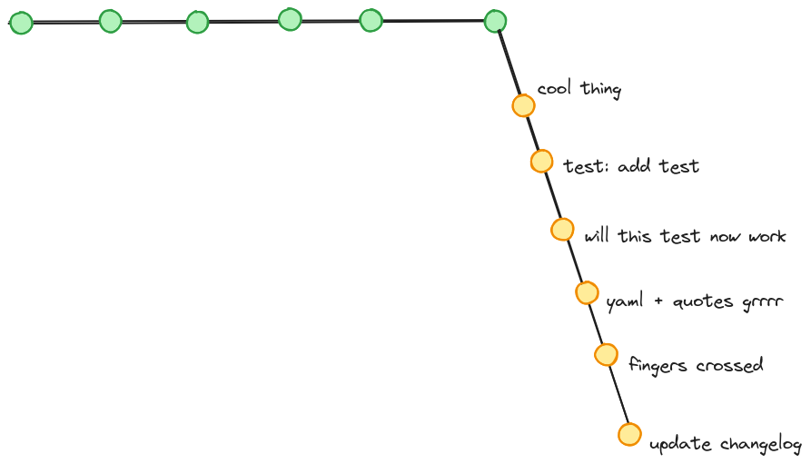. 
</figure></div>

## "Squash and merge" : haz un clic en el botón corecto de GitHub/GitLab.

<div style="display:grid ; margin-top : 0rem ;"><figure>
    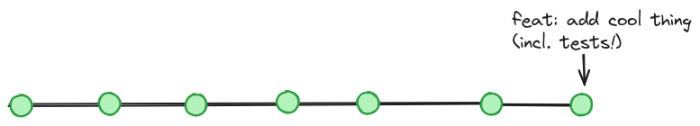 
</figure></div>

## "Squash and merge" : haz un clic en el botón corecto de GitHub/GitLab. {.center}

[Ejemplo](https://github.com/tidyverse/duckplyr/pull/543)

## "Empezar de cero"

::: {.incremental}

- `git reset --mixed` Cambios en los archivos *pero no en el historial de Git*.

- `git add (--patch)` Buenos commits, en retrospectiva.

:::

## `git add --patch`: práctica {.center}

10 minutos

```r
withr::local_language("es")
dir  <- withr::local_tempdir()
saperlipopette::exo_split_changes(dir)
```

## "Empezar de cero": práctica {.center}

15 minutos

```r
withr::local_language("es")
dir  <- withr::local_tempdir()
saperlipopette::exo_reset(dir)
```

## "Mezcla y combina tus commits" {.center}

`git rebase -i`

## "Mezcla y combina tus commits": práctica {.center}

`git rebase -i`

15 minutos

```r
withr::local_language("es")
dir  <- withr::local_tempdir()
saperlipopette::exo_rebase_i(dir)
```

## "Mezcla y combina tus commits" {.center}

Recursos en inglés sobre `git rebase`


[Julia Evans' rules for rebasing](https://wizardzines.com/comics/rules-for-rebasing/)

[Julia Evans' post "git rebase: what can go wrong?"](https://jvns.ca/blog/2023/11/06/rebasing-what-can-go-wrong-/)

## Porqué tener pequeños commits informativos

Mejor historial, en particular para

- `git blame`

- `git bisect`

- `git revert`

## ¿Cómo crear mejors commits?

:sparkles: No tiene por qué hacerlo bien a la primera :sparkles:

:::{.incremental}

- La repetida enmienda :tm:

- "Squash and merge" PR

- Reempezar de cero de cero

- Mezcla y combina tus commits

:::


## {background-image="playground.jpg"}

::: {.absolute left="5%" top="5%"  style="font-size:1.4em; padding: 0.5em 1em; background-color: rgba(255, 255, 255, .8);"}

¡Practique con total seguridad con los parques de juegos de [{saperlipopette}](https://docs.ropensci.org/saperlipopette/reference/index.html) !
:::

::: {.notes}
Tobogán <https://www.pexels.com/photo/metal-slide-2326027/>
:::


## {background-image="cogs.jpg"}

::: {.absolute left="5%" top="5%"  style="font-size:1.4em; padding: 0.5em 1em; background-color: rgba(255, 255, 255, .8);"}
Gracias ! :blue_heart:

<https://historial-git.netlify.app>

<https://docs.ropensci.org/saperlipopette/>
:::

::: {.notes}
Engranajes <https://www.pexels.com/photo/colorful-toothed-wheels-171198/>
:::
